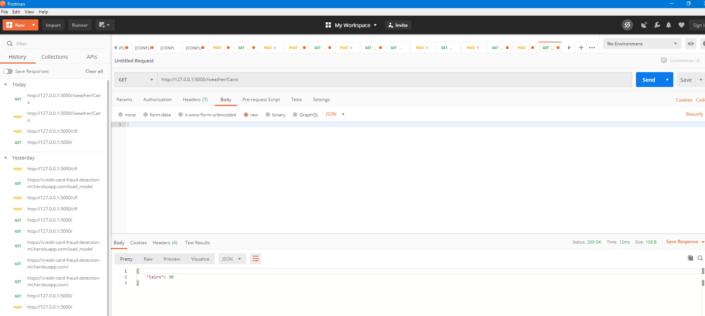

# WeatherAPI_msattar
REST API example application
This is a city-temperature example of a application providing a API to get the temperature.

WeatherClient.py runs a simplistic test and generates of API.

When you run the test you can choose one of these city to see the API proccess.

###
to use the dashboard follow these steps

* create a virtualenv and activate it

```bash
$python -m venv venv
$source venv/bin/activate
```

* install all the requirements

```bash
$pip install -r requirements.txt
```

Now you are ready to go !

* start the app from `app.py`

```bash
$python app.py
```

you will find a message ending with the url like so

```bash
 * Running on http://127.0.0.1:9000/ (Press CTRL+C to quit)
```
The API to the example app is described below.

Get Weather Temperature for non existed city:
Request
GET

http://127.0.0.1:5000/weather/BokaBoka

Response
{"temperature": "not is not existed in our database Sorry For good luck next time!!!!}

+++++++++++++++++++++++++++++++++++++

Get Weather Temperature for existed City:
Request
GET

http://127.0.0.1:5000/weather/Cairo

Response
{"Cairo":30}



## TRY IT lIVE ON HEROKU
## heroku link:

### https://weatherapimsattar.herokuapp.com/
### output:
## Weather API by Mahmoud Abd Elsattar !

### https://weatherapimsattar.herokuapp.com/weather/Al Ain
### output:
## {"Al Ain":33}
